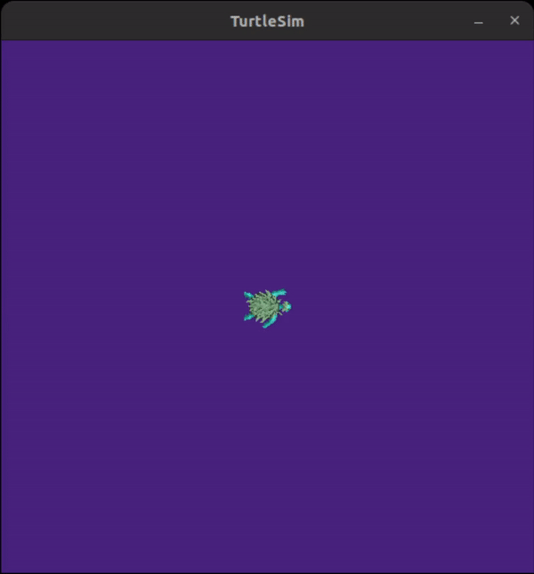
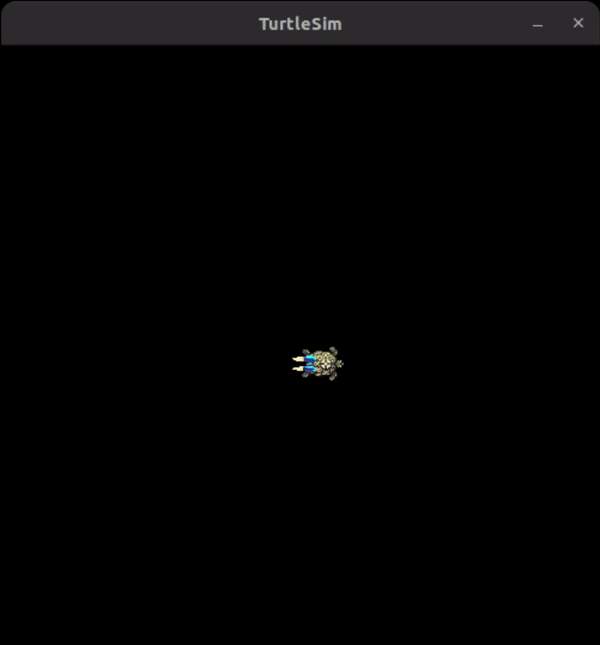
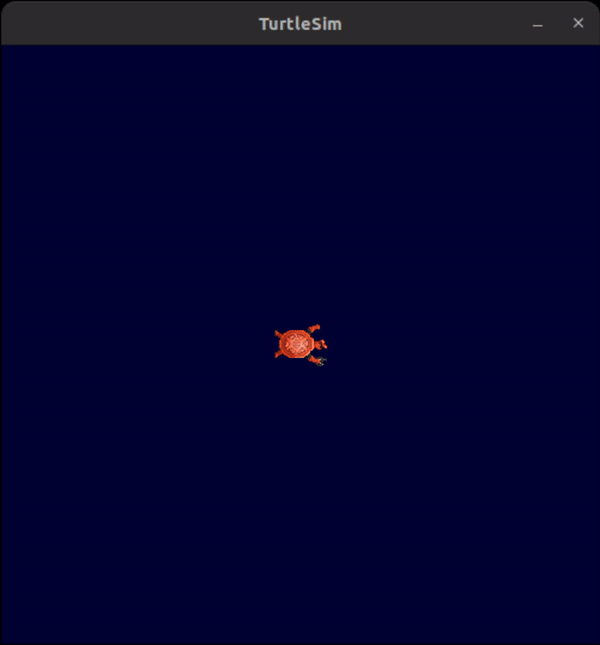

# Udemy_ROS2_Level_1_Complete_Project

1. Publisher/Subscriber
2. Client/Server
3. Msg/Srv
4. Parameters
5. Launch
6. TurtleSim


**How to run:**

**build:**

`colcon build`

`source install/setup.bash`

**Running first vesrion** 
```bash
ros2 launch turtle_killer_bringup turtle_killer_app.launch.py
```


**Running second vesrion** 
```bash
ros2 launch turtle_killer_bringup turtle_killer_app_v2.launch.py
```


**Running third vesrion** 
```bash
ros2 launch turtle_killer_bringup turtle_killer_app_v3.launch.py
```

